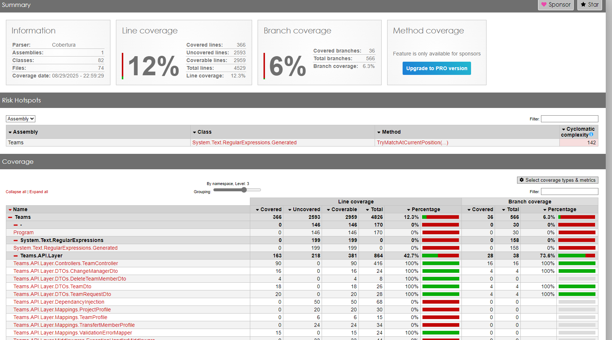

### Couverture de code


# Présentation du projet  
Ce projet utilise les patterns suivants et une stack technique moderne pour assurer modularité, testabilité et scalabilité.

### 🔁 Pattern utilisés

- **DDD** :              Séparation claire entre domaine, l'infrastructure, présentation et applicatif.
- **CQRS** :             Distinction entre commandes (écriture) et requêtes (lecture).
- **MediatR** :          Gestion centralisée des commandes, requêtes et événements.
- **Automapper** :       Mappage entre DTOs et entité.
- **FluentValidation** : Validation des données.
- **Domain Event** :     Chaque evènement important du domain est géré via le domain event.
- **Dispatchers** :      CQRS dispatchers,In-process dispatcher (validation de transaction après commit), EDA dispatcher (outboxing)

---

## 🔧 Tech Stack

- **.NET 8**
- **C#**
- **MediatR**
- **AutoMapper**
- **Wrapper**
- **Entity Framework Core**
- **JWT Auth**
- **Hashicorp Vault**
- **OpenTelemetry**
- **Swagger**

---
# 🧩 Architecture du Projet

> Une vue d’ensemble des différentes couches et fichiers de l’application.

---

## 📦 API.Layer

**Controllers**  
- 📄 `TeamController.cs`

**DTOs**  
- 📄 `ChangeManagerDto.cs`
- 📄 `TeamDto.cs`


**Middlewares**  
- 📄 `HandlerException.cs`
- 📄 `JwtBearerAuthenticationMiddleware.cs`


**Mappings**  
- 📄 `ProjectProfile.cs`
- 📄 `TeamProfile.cs`


**Shared.Logging**  
- 📄 `SerilogConfiguration.cs`

**Autres**  
- 📄 `DependancyInjection.cs`
- 📄 `Program.cs`
- 📄 `appsettings.Development.json`

---

## 🧠 APP.Layer

**CQRS / Commands**  
- 📄 `CreateTeamCommand.cs`


**CQRS / Handlers**  
- 📄 `CreateTeamHandler.cs`


**CQRS / Queries**  
- 📄 `GetAllTeamsQuery.cs`
- 📄 `GetTeamQuery.cs`

**CQRS / Validators**  
- 📄 `CQRS/Validators/AddTeamMemberRecordValidator.cs`
- 📄 `CQRS/Validators/CreateTeamCommandValidator.cs`


**EventNotification**
- `DomainEventNotification.cs`

**Helpers**  
- 📄 `LogHeper.cs`

**Interfaces**  
- 📄 `IBackgroundJobService.cs`
- 📄 `IEmployeeService.cs`


**Services**  
- 📄 `BackgroundJobService.cs`
- 📄 `EmployeeService.cs`
- 📄 `ProjectService.cs`
- 📄 `ProjectExpiryScheduler.cs`


**Autres**  
- 📄 `DependancyInjection.cs`

---

## 🧱 CORE.Layer

**BusinessExceptions**  
- 📄 `DomainException.cs`

**CoreEvents**
- 📄 `TeamCreatedEvent.cs`

**Entities**  
- 📄 `Entities/Team.cs`
    **ValueObjects**  
    - 📄 `ProjectAssociation.cs`
    - 📄 `TransfertMember.cs`

**CoreInterfaces**  
- 📄 `ITeamRepository.cs`

---

## ⚙️ INFRA.Layer

**DependancyInjection**  
- 📄 `DependancyInjection.cs`

**ExternalServices**  
- 📄 `RabbitListenerService.cs`
- 📄 `RedisCacheService.cs`
- 📄 `TeamExternalService.cs`

**ExternalServicesDtos**  
- 📄 `ProjectAssociationDto.cs`
- 📄 `TransfertMemberDto.cs`

**Dispatchers**  
- 📄 `DomainEventDispatcher.cs`

**Persistence**  
- 📂 `Persistence/Migration/` *(contenu non détaillé)*
- 📄 `Persistence/Repositories/TeamRepository.cs`
- 📄 `Persistence/Configurations/TeamConfiguration.cs`
- 📄 `Persistence/TeamDbContext.cs`

## 📘 Légende

| Emoji | Signification           |
|-------|-------------------------|
| 📁 / 📂 | Dossier / Sous-dossier    |
| 📄     | Fichier                  |

---

## ▶️ Lancer le projet

1. Cloner le repo :
```bash
git clone https://github.com/LAMBOFIRSTECH/Team-microservice
....
2. 
🧪 Tests
```bash
git clone https://github.com/LAMBOFIRSTECH/Team-microservice/Teams.Tests
``` 

2. Déploiement dans un conteneur docker :

# CI/CD Pipeline GitLab – Documentation Complète

## Table des matières
- [Introduction](#introduction)
- [Architecture de la pipeline](#architecture-de-la-pipeline)
- [Variables importantes](#variables-importantes)
- [Étapes clés](#étapes-clés)
- [Déploiement](#déploiement)
- [Stratégie de rollback](#stratégie-de-rollback)
- [Health Check & Monitoring](#health-check--monitoring)
- [Trigger automatique de rollback](#trigger-automatique-de-rollback)
- [Conseils d’utilisation](#conseils-dutilisation)

---

## Introduction

Ce pipeline GitLab CI/CD est conçu pour assurer un processus de build, test, analyse de vulnérabilités, déploiement, et monitoring robuste pour les applications .NET et Dockerisées.

Il inclut une **stratégie avancée de rollback** basée sur la santé de l’application déployée, garantissant qu’aucun déploiement défectueux ne reste actif sans intervention.

---

## Architecture de la pipeline

La pipeline est organisée en plusieurs étapes (`stages`) :

| Stage                   | Description                                 |
|-------------------------|---------------------------------------------|
| pre-treatment           | Nettoyage et préparation du workspace       |
| build                   | Compilation du projet                        |
| test                    | Exécution des tests unitaires                |
| scan-vulnerabilities    | Analyse des vulnérabilités avec Trivy       |
| sonar-build-and-analysis| Analyse de qualité de code avec SonarQube  |
| deploy                  | Déploiement en environnement (dev/staging) |
| health-check            | Vérification de la santé de l’application   |
| rollback                | Rollback manuel ou automatique en cas d’échec |

---

## Variables importantes

| Variable                | Usage                                              |
|-------------------------|----------------------------------------------------|
| `BUILD_CONFIGURATION`   | Mode de build (`Release` )               |
| `NUGET_PACKAGES_DIRECTORY` | Cache local des packages NuGet                  |
| `HEALTH_ENDPOINT`       | URL du endpoint HTTP à checker pour la santé       |
| `TRIGGER_ROLLBACK_URL`  | URL GitLab pour déclencher le rollback automatique |

---

## Étapes clés

- **Build & Test** : Compilation et validation via tests unitaires.
- **Scan vulnérabilités** : Scan Docker + dépendances avec Trivy.
- **Analyse qualité** : Exécution SonarQube.
- **Déploiement** : Docker build + push + lancement via Nomad Hashicorp.
- **Health Check** : Monitoring post-déploiement, retries inclus.
- **Rollback** : Automatique sur échec health-check, sinon manuel.

---

## Déploiement

Le déploiement utilise nomad de chez hashicorp avec des tags versionnés générés automatiquement (`image_tag.sh`).  
Chaque build génère un tag unique, stocké dans `.docker_tag` pour suivi.

---

## Stratégie de rollback

- **Rollback automatique** :  
  Si le health-check (endpoint `/health`) échoue 5 fois consécutives, la pipeline déclenche un rollback vers la version stable précédente.

- **Rollback manuel** :  
  Un job manuel `rollback_staging` permet d’effectuer un rollback via GitLab UI à tout moment.

Les tags Docker sont utilisés pour revenir à la version précédente connue.

---

## Health Check & Monitoring

- La pipeline exécute un job `health_check` post-déploiement.
- Le job tente 5 fois de vérifier la santé de l’application (via `curl`).
- En cas d’échec, rollback automatique ou notification est déclenché.

---

## Trigger automatique de rollback

Pour déclencher automatiquement la pipeline de rollback, configurez dans la variable `TRIGGER_ROLLBACK_URL` une URL de trigger GitLab.

Exemple de commande curl pour déclencher un pipeline (à utiliser dans le script) :

```bash
curl -X POST "https://gitlab.com/api/v4/projects/<project_id>/trigger/pipeline" \
     -F "token=<trigger_token>" \
     -F "ref=main" \
     -F "variables[ROLLBACK_TRIGGER]=true"


🤝 Contribuer
Les PRs sont les bienvenues. Merci de respecter l’architecture DDD et les conventions du projet.

📄 License
MIT – free to use, modify, and distribute.
